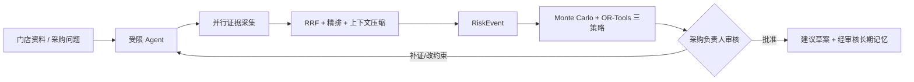

# StoreFlow：连锁零售补货风险决策 Agent

StoreFlow 服务于连锁零售企业的区域采购负责人。在促销、天气、中央仓到货延迟、库存不足与销量波动同时出现时，它汇集可追溯证据、识别风险、比较补货方案，并交由负责人审核。

固定范围：**单区域 / 单门店 / 单 SKU / 单补货周期**。默认演示为瓶装饮料。系统只生成采购建议草案：不连接 ERP，不创建采购单，不扣减库存，也不宣称生产级预测或多 SKU 优化能力。

## 为什么不是普通 RAG

StoreFlow 是受限自治 Agent：LangGraph 控制“选择下一步 → 调用白名单复合工具 → Observation → 再规划”的循环。Manager 只可选择取证、评估证据缺口、决策分析、提交审核或结束；一次取证工具内部并行完成内部资料、公开风险和已批准记忆的采集，再统一 RRF、重排与压缩。Agent 最多 6 步、最多 2 次检索；模型只返回结构化工具动作，不保存自由式思维链。关键订货量由固定种子 Monte Carlo 与 OR-Tools 计算，决策草案会自动进入人工审核。



## 已实现

- 内部 PDF 在入库时按页码和段落切为约 300–500 token 的独立检索 chunk；Chunk 级 BM25/向量、RRF、重排序后保留页码与字符偏移，供 Evidence ID 精确回溯。已批准记忆与 Tavily/公开风险仍保持各自的信任边界。
- Evidence ID 约束的风险事件；冲突来源保持待裁决，不自动变成事实。
- 工作记忆、情景任务快照与仅审核后可复用的长期业务记忆。
- 三种明确风险偏好的订货策略：成本优先、平衡型、服务优先；展示成本、服务水平、缺货概率、CVaR 与约束可行性。
- LangGraph interrupt + MySQL checkpoint 的持久化 HITL；Celery + Redis Streams 的异步任务和可续传 SSE。
- JWT/RBAC、SSRF 防护、JSON 日志、Prometheus 指标、Docker Compose。
- 冻结模拟评测：48 个问题、96 条金标 Evidence、12 条同义问法、48 条无关干扰与 24 条跨维度/冲突资料（共 168 文档）；以本地 BM25、哈希向量和 RRF+本地 rerank 的离线指标对比，详见 [评测集说明](docs/evaluation-dataset.md)。

## 快速启动

```powershell
cd C:\Users\17818\Desktop\codex_learn\agent_program\supplymind
& 'C:\Users\17818\AppData\Local\Programs\DockerDesktop\resources\bin\docker.exe' compose up --build -d
```

打开 `http://localhost:5174/`。服务状态：

```powershell
docker compose ps
```

无需 Key 也能运行确定性演示；设置 `BAILIAN_API_KEY` 和/或 `TAVILY_API_KEY` 后才启用对应外部能力，失败会留下可审计的降级记录。

## 固定 Demo

“周末暴雨 + 饮料促销 + 中央仓配送延迟 + 门店库存仅够 1.5 天”。完整步骤见 [Demo 运行手册](docs/demo-runbook.md)，一键验收：

```powershell
.\.venv\Scripts\python.exe scripts\v2_demo_smoke.py --base-url http://127.0.0.1:5174/api
```

## 文档

- [产品定位与业务边界](docs/storeflow-positioning.md)
- [控制台使用手册](docs/user-guide.md)
- [架构与状态机](docs/architecture.md)
- [学习地图：RAG、记忆、上下文与 Agent](docs/learning-architecture-guide.md)
- [故障降级矩阵](docs/fallback-matrix.md)
- [评测集与回归说明](docs/evaluation-dataset.md)
- [冻结模拟语料离线评测报告](docs/evaluation-report.md)
- [本机验收报告](docs/acceptance-report.md)
- [Demo 手册](docs/demo-runbook.md)
- [项目手册](docs/project-handbook.md)

## 开源与安全

本仓库使用 [MIT License](LICENSE)，仅包含模拟门店资料与公开演示代码。复制 `.env.example` 为本机 `.env` 后再配置百炼、Tavily 或数据库连接；绝不上传 `.env`、API Key、JWT 密钥、真实企业资料或数据库快照。详情见 [SECURITY.md](SECURITY.md)。

仓库中仍保留的历史内部技术命名仅用于兼容已有容器、数据库或缓存数据，不属于产品叙事。
