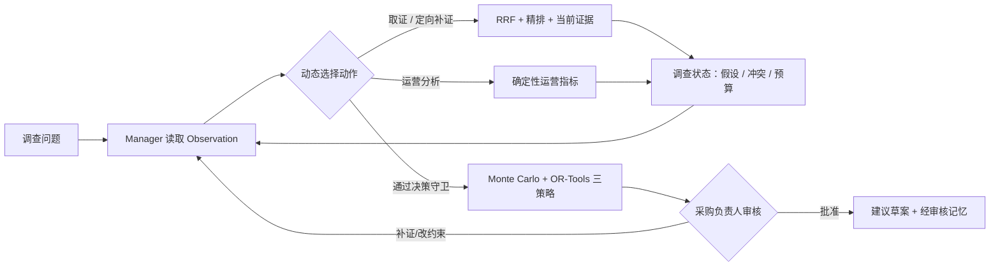
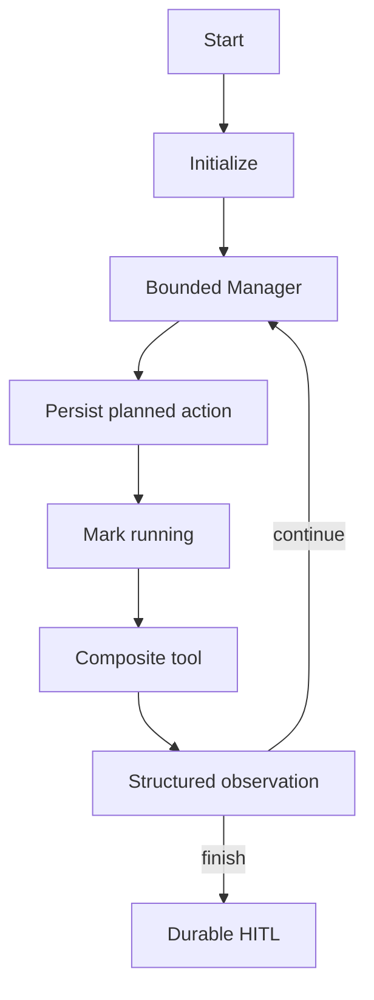

# StoreFlow：供应链异常调查与补货决策 Agent

StoreFlow 服务于连锁零售企业的区域采购负责人。当促销、天气、中央仓到货延迟、库存不足与销量波动同时出现时，它以“调查 → 核验 → 决策 → 人审”为主线，汇集当前证据与确定性运营分析，形成可审核的补货建议。

固定范围：**单区域 / 单门店 / 单 SKU / 单补货周期**。默认演示为瓶装饮料。系统只生成采购建议草案：不连接 ERP，不创建采购单，不扣减库存，也不宣称生产级预测或多 SKU 优化能力。

## 为什么不是普通 RAG

StoreFlow 是单 Manager 的受限 ReAct Agent：LangGraph 控制“选择下一步 → 调用白名单复合工具 → Observation → 再规划”的循环。Manager 根据 Observation 动态选择取证、确定性运营分析、调查状态评估、决策分析、提交审核或结束；第二次取证会围绕库存、需求、配送或成本中的未解决假设定向补证。动作契约为 `{tool, focus, reason}`，默认最多 6 步、最多 2 次检索、最多 4 次模型选择；模型不保存自由式思维链。关键订货量由固定种子 Monte Carlo 与 OR-Tools 计算，决策草案会自动进入人工审核。



## Agent Runtime



Runtime policy: tool whitelist、schema validation、`max_loop=6`、`max_search=2`、`max_model_decisions=4`、action idempotency 和 LangGraph native checkpoint。MySQL TaskRepository 保存可查询的业务状态与 `state_version` 乐观锁；Celery 只负责异步调度，Redis Streams/SSE 只负责事件推送。

## 已实现

- 内部长 PDF 使用 Parent–Child 分块：约 300–500 token 的 Child 完成 BM25/向量、RRF 与重排序；命中后按 `parent_id` 回溯受预算限制的 Parent 上下文。Tavily/网页按约 300–500 token 的临时 Chunk 进行 BM25/向量、RRF 与重排序，不写入内部知识库。Evidence 始终引用精确 Chunk，并保留页码或字符偏移。已批准记忆保持独立的历史 Prior 边界。
- Evidence ID 约束的风险事件；冲突来源保持待裁决，不自动变成事实。
- 工作记忆、情景任务快照与仅审核后可复用的长期业务记忆；长期记忆先选择轻量 summary catalog，再受独立 token 预算加载少量正文，替代版本只在新候选批准时原子切换。长期记忆分为 episodic（历史案例）、semantic（稳定事实）与 procedural（审核规则）；Agent 只能自动提出 episodic 候选，procedural 仅允许 reviewer/admin 人工创建。
- 三种明确风险偏好的订货策略：成本优先、平衡型、服务优先；展示成本、服务水平、缺货概率、CVaR 与约束可行性。
- 内置且明确标注的模拟运营数据：确定性计算需求偏离、促销 uplift、库存覆盖天数和提前期偏离；调查假设始终以结构化状态展示，不展示私有推理链。
- LangGraph interrupt + MySQL checkpoint 的持久化 HITL；Celery + Redis Streams 的异步任务和可续传 SSE。
- JWT/RBAC、SSRF 防护、JSON 日志、Prometheus 指标、Docker Compose。
- 冻结模拟评测：48 个问题、96 条金标 Evidence、12 条同义问法、48 条无关干扰与 24 条跨维度/冲突资料（共 168 文档）。无真实 embedding 时演示默认走 BM25 + 本地 explainable rerank；配置 embedding 后才启用 BM25 + vector + RRF，详见 [评测集说明](docs/evaluation-dataset.md)。

## 快速启动

```powershell
cd C:\Users\17818\Desktop\codex_learn\agent_program\supplymind
& 'C:\Users\17818\AppData\Local\Programs\DockerDesktop\resources\bin\docker.exe' compose up --build -d
```

打开 `http://localhost:5174/`。服务状态：

```powershell
docker compose ps
```

无需 Key 也能运行确定性演示；设置 `BAILIAN_API_KEY` 和/或 `TAVILY_API_KEY` 后才启用对应外部能力，失败会留下可审计的降级记录。

## 固定 Demo

“上海浦东门店瓶装饮料近期出现缺货风险，请调查促销、库存和中央仓配送是否构成主要风险，并给出本周期补货建议。”完整步骤见 [Demo 运行手册](docs/demo-runbook.md)，一键验收：

```powershell
.\.venv\Scripts\python.exe scripts\v2_demo_smoke.py --base-url http://127.0.0.1:5174/api
```

## 文档

- [产品定位与业务边界](docs/storeflow-positioning.md)
- [控制台使用手册](docs/user-guide.md)
- [架构与状态机](docs/architecture.md)
- [调查引擎](docs/investigation-engine.md)
- [双层 HITL 与长期记忆](docs/memory-hitl.md)
- [持久化与恢复](docs/persistence-recovery.md)
- [学习地图：RAG、记忆、上下文与 Agent](docs/learning-architecture-guide.md)
- [故障降级矩阵](docs/fallback-matrix.md)
- [评测集与回归说明](docs/evaluation-dataset.md)
- [冻结模拟语料离线评测报告](docs/evaluation-report.md)
- [本机验收报告](docs/acceptance-report.md)
- [Demo 手册](docs/demo-runbook.md)
- [项目手册](docs/project-handbook.md)

## 开源与安全

本仓库使用 [MIT License](LICENSE)，仅包含模拟门店资料与公开演示代码。复制 `.env.example` 为本机 `.env` 后再配置百炼、Tavily 或数据库连接；绝不上传 `.env`、API Key、JWT 密钥、真实企业资料或数据库快照。详情见 [SECURITY.md](SECURITY.md)。

仓库中仍保留的历史内部技术命名仅用于兼容已有容器、数据库或缓存数据，不属于产品叙事。
