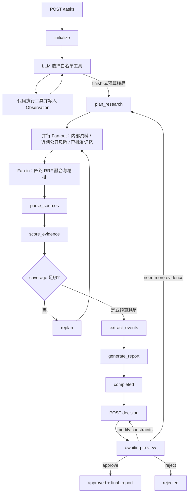

# StoreFlow 架构与状态机

MySQL 持久化任务状态、checkpoint、审计记录与决策结果；Redis 缓存 URL 内容；Qdrant 存储内部 PDF 和向量检索载荷。每个节点写入 trace；失败写入 errors 并以受控降级继续，不生成无证据 RiskEvent。

其中只有互不依赖、只读的三条证据通道会并行：内部资料、近期公开风险和已批准长期记忆。它们完成后再统一执行 RRF 融合、重排序和上下文压缩；仿真、策略选择和人工审核保持顺序执行，确保约束与审计链可复现。
