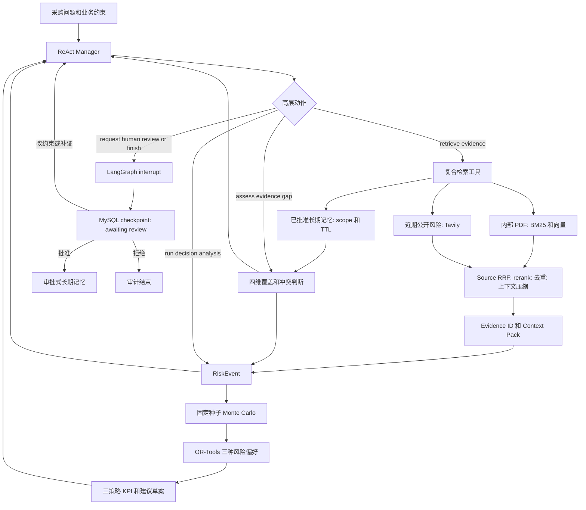

# StoreFlow 架构与状态机

StoreFlow 是单 Manager、受限 ReAct Agent。LLM 不直接检索、计算订货量或修改业务系统；它只从高层动作中选择下一步，动作由确定性复合工具执行并返回受控 Observation。



## 动作级恢复语义

每个 Manager 选择的高层动作都先写入完整任务快照，再运行工具：

```text
planned → running → completed
                  ├→ failed
                  └→ worker interruption → unknown → retry with same action_id
```

动作记录包含稳定的 `action_id`、由 `task_id:action_id` 派生的幂等键、执行次数、开始/完成时间、Observation 和关联 Evidence ID。checkpoint 的 `node` 只表示最后成功持久化的执行阶段；恢复路由同时读取 `active_action.status`：`planned` 进入执行准备，`running/unknown` 先标记中断再以相同动作 ID 重试，`completed/failed` 回到 Manager。当前工具均为只读；这提供本地状态幂等和外部请求可审计的至少一次重试语义，而不宣称跨 Tavily/数据库的分布式 exactly-once。

## 高层白名单与停止规则

Manager 只能选择 `retrieve_evidence`、`assess_evidence_gap`、`run_decision_analysis`、`request_human_review`、`finish`。`retrieve_evidence` 是唯一的证据采集入口：内部资料与近期公开风险两条 **Source** 通道并行后统一进行 RRF、重排、去重、元数据过滤、上下文压缩和 Evidence ID 绑定。已批准的 **Memory** 同时按 scope 与 TTL 筛选为 Historical Prior Top-K，但不进入 Source RRF、Evidence、Context Pack 或 RiskEvent 引用。因此不会出现“Agent 逐项查一次，固定流程再 Fan-out 一次”的重复链路，也不会把历史经验误当作当前事实。

当库存、需求、到货、成本四维均有证据且没有未裁决关键冲突时，进入决策；否则在最多 6 步、最多 2 次检索、上下文 token 与延迟预算内补证。预算耗尽仍会生成带降级原因的建议草案，并自动交给人工审核，不会自动下单。

## 状态与持久化归属

| 状态域 | 包含内容 | 持久化与职责 |
| --- | --- | --- |
| Task 生命周期 | `queued/running/completed/awaiting_review/approved/rejected`、幂等键、审计 | MySQL 任务快照；Redis Streams 发布状态事件 |
| Agent 工作状态 | 已选动作、Observation 摘要、预算、覆盖缺口、Evidence ID | LangGraph State + MySQL checkpoint；不记录自由式思维链 |
| Business Inputs | 区域、门店、SKU、库存、需求、提前期、成本与预算 | MySQL 任务快照；仅用于单门店单 SKU 单周期模拟 |
| Decision/Review | RiskEvent、三策略 KPI、约束 diff、审核意见、记忆候选 | MySQL；审核通过后才由 Qdrant/记忆索引提供跨任务召回 |

内部资料向量与元数据由 Qdrant 承载；Redis 仅用于 URL 缓存和任务事件，不能作为长期业务事实来源。详细故障行为见 [Fallback Matrix](fallback-matrix.md)。

`checkpoint.version` 与 `state_version` 是两条独立的版本线：前者描述 Agent 已持久化的执行位置，后者是 MySQL 任务快照的乐观锁版本。每次写入都以 `WHERE state_version = expected` compare-and-swap；旧 worker 或并发审核写入不会覆盖较新的完整 State，而是收到冲突并重新读取。
