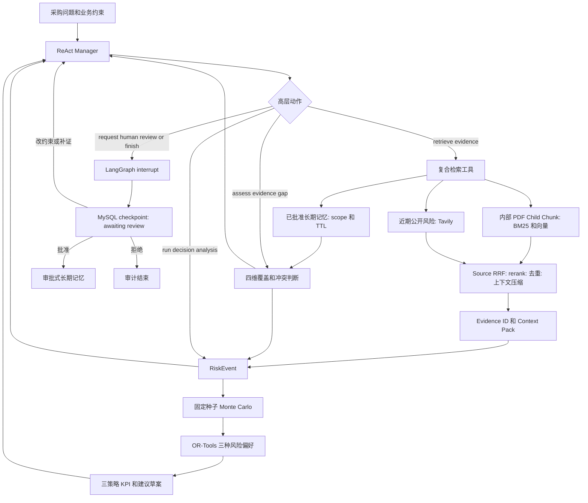

# StoreFlow 架构与状态机

StoreFlow 是单 Manager、受限 ReAct Agent。LLM 不直接检索、计算订货量或修改业务系统；它只从高层动作中选择下一步，动作由确定性复合工具执行并返回受控 Observation。



## 动作级恢复语义

每个 Manager 选择的高层动作都先写入完整任务快照，再运行工具：

```text
planned → running → completed
                  ├→ failed
                  └→ worker interruption → unknown → retry with same action_id
```

动作记录包含稳定的 `action_id`、由 `task_id:action_id` 派生的幂等键、执行次数、开始/完成时间、Observation 和关联 Evidence ID。checkpoint 的 `node` 只表示最后成功持久化的执行阶段；恢复路由同时读取 `active_action.status`：`planned` 进入执行准备，`running/unknown` 先标记中断再以相同动作 ID 重试，`completed/failed` 回到 Manager。当前工具均为只读；这提供本地状态幂等和外部请求可审计的至少一次重试语义，而不宣称跨 Tavily/数据库的分布式 exactly-once。

## 高层白名单与停止规则

Manager 只能选择 `retrieve_evidence`、`assess_evidence_gap`、`run_decision_analysis`、`request_human_review`、`finish`。`retrieve_evidence` 是唯一的证据采集入口：内部 PDF 在入库时先按页码/段落形成约 1,000–1,800 token 的 **Parent**，再切成约 300–500 token 的 **Child Chunk**。BM25、向量、RRF 与重排只在 Child 层完成；命中后通过 `parent_id` 取得受 token 预算限制的 Parent 窗口。Tavily/网页则在每次任务内切为约 300–500 token 的 **Public Chunk**，在 Chunk 层做 BM25、向量、RRF 和重排，但不写入 Qdrant 内部知识库。Evidence 始终引用命中的精确 Chunk，并将 `document_id`、页码或字符 offset 传到底层审计记录。两条 **Source** 通道并行后统一去重、元数据过滤、上下文压缩和 Evidence ID 绑定。已批准的 **Memory** 同时使用独立的 `approved + scope + TTL → Top-K` 检索：更精确的 scope、经审核置信度和新鲜度决定 Prior 排序，并返回匹配/排除原因；它不进入 Source RRF、Evidence、Context Pack 或 RiskEvent 引用。因此不会出现“Agent 逐项查一次，固定流程再 Fan-out 一次”的重复链路，也不会把历史经验误当作当前事实。未来记忆量明显增长后才考虑在其独立链路中增加 Memory BM25 + Vector + RRF。

替代长期记忆采用安全版本切换：创建 replacement candidate 时，旧记忆仍为 `approved` 并可继续召回；只有审核人批准该候选时，MySQL 的同一事务才同时将新记忆改为 `approved`、旧记忆改为 `superseded`。因此候选被拒绝、过期或审核中断都不会造成已审核经验的召回空窗。长期记忆的召回分为 catalog 与 body 两阶段：先用 `summary / kind / scope / confidence / TTL` 选择最多 5 条，再用独立的 1600-token 默认预算加载正文；它们始终作为 Historical Prior，不会挤占 Evidence Pack 或变成当前 RiskEvent 引用。

`kind` 是生命周期策略而非展示标签：`episodic` 为任务 Agent 可提出、默认 30 天有效的历史案例；`semantic` 为 reviewer/admin 人工提出、默认 180 天有效的稳定业务事实；`procedural` 为 reviewer/admin 人工维护、默认 365 天有效的审核规则/流程。三类都仍需 Evidence ID、scope 与人工批准；任务 Agent 无法把一次执行自动提升为 semantic 或 procedural 规则。

长期记忆还保存 `origin_task_id`、`reviewed_at`、内容哈希、`revision`、`possible_duplicate_of` 与 `conflicts_with`。创建候选时，仅在同 workspace、同 scope、同 kind 的候选/已批准记忆中用确定性内容哈希、词项重叠和显式相反规则生成**审核提示**；系统绝不自动合并、重写、过期或覆盖已有记忆。replacement candidate 继承来源任务并递增 revision，最终仍由审核人决定是否完成原子替换。

决策批准后由确定性 `MemoryCandidateExtractor` 形成候选，而不再拼接 RiskEvent 原文：它要求已批准策略、至少一个合法业务 scope，以及每个保留风险事件的已验证 Evidence ID；工具日志、失败信息、原始临时库存/时间数值不会复制到长期记忆正文。当前阶段每个任务最多产出一条 `episodic` 候选，正文仅表达“风险模式 + 已批准策略 + 必须重新核验当期证据”的历史先验；候选提取被拒绝时会持久化原因，但不影响已批准的当前任务决策。

当库存、需求、到货、成本四维均有证据且没有未裁决关键冲突时，进入决策；否则在最多 6 步、最多 2 次检索、上下文 token 与延迟预算内补证。预算耗尽仍会生成带降级原因的建议草案，并自动交给人工审核，不会自动下单。

## 状态与持久化归属

| 状态域 | 包含内容 | 持久化与职责 |
| --- | --- | --- |
| Task 生命周期 | `queued/running/completed/awaiting_review/approved/rejected`、幂等键、审计 | MySQL 任务快照；Redis Streams 发布状态事件 |
| Agent 工作状态 | 已选动作、Observation 摘要、预算、覆盖缺口、Evidence ID | LangGraph State + MySQL checkpoint；不记录自由式思维链 |
| Business Inputs | 区域、门店、SKU、库存、需求、提前期、成本与预算 | MySQL 任务快照；仅用于单门店单 SKU 单周期模拟 |
| Decision/Review | RiskEvent、三策略 KPI、约束 diff、审核意见、记忆候选 | MySQL；审核通过后才由 Qdrant/记忆索引提供跨任务召回 |

内部资料向量与元数据由 Qdrant 承载；Redis 仅用于 URL 缓存和任务事件，不能作为长期业务事实来源。详细故障行为见 [Fallback Matrix](fallback-matrix.md)。

`checkpoint.version` 与 `state_version` 是两条独立的版本线：前者描述 Agent 已持久化的执行位置，后者是 MySQL 任务快照的乐观锁版本。每次写入都以 `WHERE state_version = expected` compare-and-swap；旧 worker 或并发审核写入不会覆盖较新的完整 State，而是收到冲突并重新读取。

## 异步测试约定

生产 API 通过 Celery `run_task.apply_async()` 提交初始任务、恢复和审核补证；测试环境在 Celery 可用时使用 `task_always_eager=True`，否则直接调用同一个 `execute_task` worker 函数，因此不依赖 Redis broker。每个测试在导入应用前固定为 SQLite、无外部模型/网页 Key，并重建任务/记忆表，避免测试收集顺序、真实 MySQL 或后台任务时序影响结果。审核要求补证会重置**新一轮** Agent 的动作预算，同时保留不可变 trace 与 audit trail。
