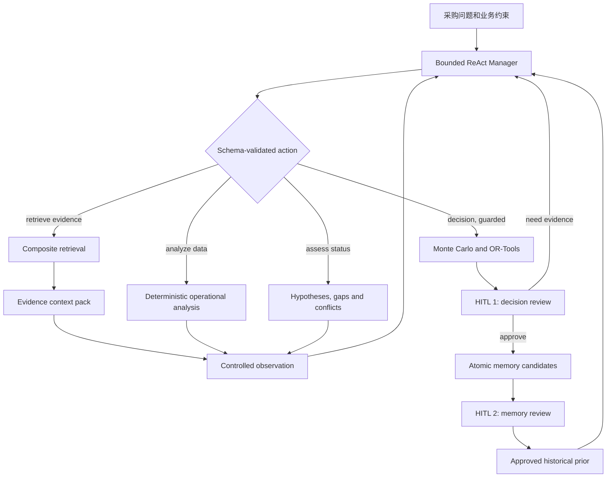

# StoreFlow 架构与状态机

StoreFlow 是单 Manager、受限 ReAct Agent。LLM 不直接检索、计算订货量或修改业务系统；它只从高层动作中选择下一步，动作由确定性复合工具执行并返回受控 Observation。

## Context Management 命名边界

`evidence_context_pack` 是当前事实证据的唯一压缩上下文包：它只包含带 Evidence ID 的、可回溯的当前来源摘录，不包含 Historical Prior、完整 `ResearchState` 或模型输出。所有预模型预算统一使用保守的 `estimate_tokens()`：对中英文、数字与标点分别估算，目的是 hard budget 安全余量而非供应商账单统计；真实模型 usage 仍由 provider 返回值记录。

单次模型请求采用固定预算策略，而不是让 Evidence 吃满窗口：默认总窗口为 14k token，预留 system/instruction 900、working state 1k、Historical Prior 1.6k、输出 1.5k；Evidence Context 最多 8k，配置不一致时会被总预算自动 clamp。风险提取与报告生成的模型输入只接收 `CURRENT_EVIDENCE_CONTEXT`（压缩摘要、Evidence ID、来源 ID 与定位元数据），原始 quote 只留在 State 中做 Evidence-to-source 校验、UI 展示和引用回溯。因此“选择/压缩”只做一次，并真正决定模型能看到的当前事实材料。

State 不会整体传入模型。`build_controller_context()` 只投影问题、scope、覆盖缺口、动作摘要、剩余预算及带 `HISTORICAL_PRIOR_NOT_CURRENT_EVIDENCE` 标签的已批准历史先验；它们只能提示下一步应核验什么。`build_risk_context()` 与 `build_report_context()` 则只投影 `CURRENT_EVIDENCE`，并显式声明 Historical Prior 未被包含，故长期记忆不能成为当前 RiskEvent 的事实或报告 Citation。

每次 Controller、Risk、Report 的模型路径（未调用、远程成功或远程降级）都追加一条 `context_telemetry`：记录估算输入 token、system/working/evidence/memory 占用、输出预留、候选/选中/丢弃证据数、Evidence ID、历史先验数量和硬预算是否满足。它不记录原始 Prompt、证据原文或自由式思维链；控制台/API 只读取这些可审计指标。



## 动作级恢复语义

每个 Manager 选择的高层动作都先写入完整任务快照，再运行工具：

```text
planned → running → completed
                  ├→ failed
                  └→ worker interruption → unknown → retry with same action_id
```

动作记录包含稳定的 `action_id`、由 `task_id:action_id` 派生的幂等键、执行次数、开始/完成时间、Observation 和关联 Evidence ID。主图恢复先读取 LangGraph 原生 MySQL checkpoint：若该线程有 pending node，worker 以 `stream(None, thread_id)` 直接续跑该节点，因此不会再让自定义 `checkpoint.node` 决定图从哪里开始。工具开始前的原生 checkpoint 含有 `active_action`，中断后会以相同动作 ID 重试。旧版本任务快照才会一次性走兼容路由：它读取 `active_action.status`，`planned` 进入执行准备，`running/unknown` 先标记中断再以相同动作 ID 重试。当前工具均为只读；这提供本地状态幂等和外部请求可审计的至少一次重试语义，而不宣称跨 Tavily/数据库的分布式 exactly-once。

## 高层白名单与停止规则

Manager 只能选择 `retrieve_evidence`、`analyze_operational_data`、`assess_investigation_status`、`run_decision_analysis`、`request_human_review`、`finish`。每个 Action 均含严格枚举的 `focus`（`all/inventory/demand/delivery/cost`）；定向检索会用未解决假设扩展第二次查询。`analyze_operational_data` 只读取明确标注的模拟运营数据，并用代码计算需求偏离、库存覆盖天数、提前期偏离和促销 uplift。`assess_investigation_status` 输出可审计的需求、库存、配送和成本假设状态（`unknown/supported/refuted/conflicting`），并结合证据冲突与预算决定继续补证或带不确定性进入决策。`retrieve_evidence` 是唯一的证据采集入口：内部 PDF 在入库时先按页码/段落形成约 1,000–1,800 token 的 **Parent**，再切成约 300–500 token 的 **Child Chunk**。BM25、向量、RRF 与重排只在 Child 层完成；命中后通过 `parent_id` 取得受 token 预算限制的 Parent 窗口。Tavily/网页则在每次任务内切为约 300–500 token 的 **Public Chunk**，在 Chunk 层做 BM25、向量、RRF 和重排，但不写入 Qdrant 内部知识库。Evidence 始终引用命中的精确 Chunk，并将 `document_id`、页码或字符 offset 传到底层审计记录。两条 **Source** 通道并行后统一去重、元数据过滤、上下文压缩和 Evidence ID 绑定。已批准的 **Memory** 是独立 Historical Prior，绝不进入 Source RRF、Evidence、Context Pack 或 RiskEvent 引用。

替代长期记忆采用安全版本切换：创建 replacement candidate 时，旧记忆仍为 `approved` 并可继续召回；只有审核人批准该候选时，MySQL 的同一事务才同时将新记忆改为 `approved`、旧记忆改为 `superseded`。因此候选被拒绝、过期或审核中断都不会造成已审核经验的召回空窗。长期记忆的召回分为 catalog 与 body 两阶段：先用 `summary / kind / scope / confidence / TTL` 选择最多 5 条，再用独立的 1600-token 默认预算加载正文；它们始终作为 Historical Prior，不会挤占 Evidence Pack 或变成当前 RiskEvent 引用。

`kind` 是生命周期策略而非展示标签：`episodic` 为任务 Agent 可提出、默认 30 天有效的历史案例；`semantic` 为 reviewer/admin 人工提出、默认 180 天有效的稳定业务事实；`procedural` 为 reviewer/admin 人工维护、默认 365 天有效的审核规则/流程。三类都仍需 Evidence ID、scope 与人工批准；任务 Agent 无法把一次执行自动提升为 semantic 或 procedural 规则。

长期记忆还保存 `origin_task_id`、`reviewed_at`、内容哈希、`revision`、`possible_duplicate_of` 与 `conflicts_with`。创建候选时，仅在同 workspace、同 scope、同 kind 的候选/已批准记忆中用确定性内容哈希、词项重叠和显式相反规则生成**审核提示**；系统绝不自动合并、重写、过期或覆盖已有记忆。replacement candidate 继承来源任务并递增 revision，最终仍由审核人决定是否完成原子替换。

决策批准后由确定性 `MemoryCandidateExtractor` 形成候选，而不再拼接 RiskEvent 原文：它要求已批准策略、至少一个合法业务 scope，以及每个保留风险事件的已验证 Evidence ID；工具日志、失败信息、原始临时库存/时间数值不会复制到长期记忆正文。当前阶段按风险维度拆分为最多三条 `episodic` 候选，每条都有独立 Evidence ID、confidence 和审核动作；正文仅表达“单一风险模式 + 已批准策略 + 必须重新核验当期证据”的历史先验。超出上限的维度与候选提取拒绝原因都会持久化，但不影响已批准的当前任务决策。

Memory HITL 是独立于决策审核的第二道门：reviewer/admin 对每条 candidate 单独 `approve` 或 `reject`，拒绝必须带原因；系统记录 `review_action`、`review_comment`、`reviewed_by` 与 `reviewed_at`。`rejected`、`expired`、`superseded` 均不可召回，只有 `approved` 能成为 Historical Prior。候选详情接口返回正文、Evidence ID、来源任务、scope、版本、重复/冲突提示与完整审核结果，便于人工逐条裁决。

当库存、需求、到货、成本四维均有证据且没有未裁决关键冲突时，进入决策；否则在最多 6 步、最多 2 次检索、上下文 token 与延迟预算内补证。预算耗尽仍会生成带降级原因的建议草案，并自动交给人工审核，不会自动下单。

## 状态与持久化归属

| 状态域 | 包含内容 | 持久化与职责 |
| --- | --- | --- |
| Task 生命周期 | `queued/running/completed/awaiting_review/approved/rejected`、幂等键、审计 | MySQL 任务快照；Redis Streams 发布状态事件 |
| Agent 工作状态 | 已选动作、Observation 摘要、预算、覆盖缺口、Evidence ID | LangGraph State；主 Research Graph 与 Review Graph 均以 `thread_id=task_id`（审核使用 `review:task_id`）写入 MySQL 原生 Checkpointer；不记录自由式思维链 |
| Business Inputs | 区域、门店、SKU、库存、需求、提前期、成本与预算 | MySQL 任务快照；仅用于单门店单 SKU 单周期模拟 |
| Decision/Review | RiskEvent、三策略 KPI、约束 diff、审核意见、记忆候选 | MySQL；审核通过后才由 Qdrant/记忆索引提供跨任务召回 |

内部资料向量与元数据由 Qdrant 承载；Redis 仅用于 URL 缓存和任务事件，不能作为长期业务事实来源。详细故障行为见 [Fallback Matrix](fallback-matrix.md)。

## 执行 Checkpoint 与业务快照

Research Graph 与 Review Graph 都通过 LangGraph 原生 MySQL Checkpointer 保存 durable execution：前者固定使用 `thread_id=task_id`，后者使用 `review:task_id` 以隔离审核 interrupt 线程。它回答“图执行到哪个节点、interrupt 后从哪里继续”。Research worker 会核对 `run_id`，仅恢复属于当前任务轮次的 pending checkpoint；完成但尚未写入业务表的 native terminal state 会被投影回 TaskRepository，而不是重新执行图。审核要求补证会生成新的 `run_id`，避免同一任务此前已结束的 checkpoint 被误当作本轮恢复点。

TaskRepository 始终是业务真相源，负责 `task_id`、`workspace_id`、幂等创建、前端查询和最新业务投影。`state_version` 是该投影的 MySQL 乐观锁版本；每次写入都以 `WHERE state_version = expected` compare-and-swap，旧 worker 或并发审核写入不会覆盖较新的完整 State，而是收到冲突并重新读取。动作级 `checkpoint.version`、`active_action` 与 `action_id` 继续用于工具幂等、审计与故障排查，而非替代 LangGraph 的执行 checkpoint。

不再维护独立的 TaskSnapshotHistory 或旧 `checkpoints` 表：它们会重复 TaskRepository 投影与 LangGraph checkpoint。`ReviewRecord` 仍单独保存审核审计，任务查询仍从 TaskRepository 读取最新业务状态。

## 异步测试约定

生产 API 通过 Celery `run_task.apply_async()` 提交初始任务、恢复和审核补证；测试环境在 Celery 可用时使用 `task_always_eager=True`，否则直接调用同一个 `execute_task` worker 函数，因此不依赖 Redis broker。每个测试在导入应用前固定为 SQLite、无外部模型/网页 Key，并重建任务/记忆表，避免测试收集顺序、真实 MySQL 或后台任务时序影响结果。审核要求补证会重置**新一轮** Agent 的动作预算，同时保留不可变 trace 与 audit trail。
