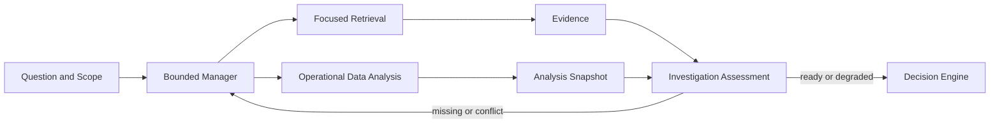

# Investigation Engine

```mermaid
flowchart LR
  A[Question and Scope] --> B[Bounded Manager]
  B --> C[Focused Retrieval]
  B --> D[Operational Data Analysis]
  C --> E[Evidence]
  D --> F[Analysis Snapshot]
  E --> G[Investigation Assessment]
  F --> G
  G -->|missing or conflict| B
  G -->|ready or degraded| H[Decision Engine]
```

调查状态以 `unknown / supported / refuted / conflicting` 表示，不保存自由式思维链。运营数据只对固定 Demo scope 可用。
