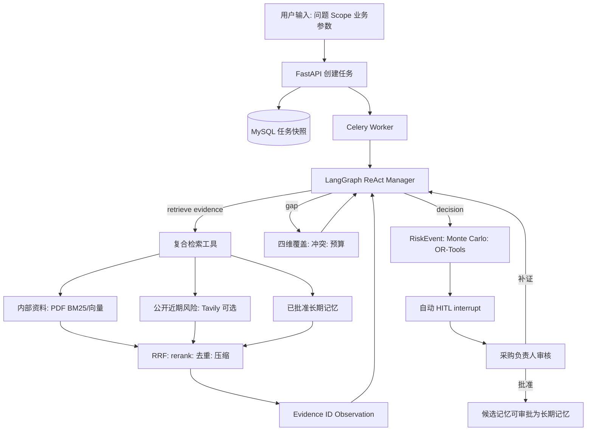

# StoreFlow 学习地图：RAG、记忆、上下文与 Agent 架构

这份文档只解释当前仓库**已经实现**的行为。先记住一句总纲：

> **LLM 管下一步做什么；检索/仿真工具管具体怎么做；数据库管状态和事实；人管高影响决策。**

StoreFlow 是单门店、单 SKU、单补货周期的模拟决策原型。它不连接 ERP、不自动下单。

---

## 1. 先画出全链路



**重要：** 不是“先固定跑一长串节点，再让 LLM 总结”。Manager 每一轮接收 Observation 后选择下一步；但它只能从白名单高层动作里选，不能调用下单、Shell、ERP 或库存写入。

源码入口：

- 图与循环：[app/agent/graph.py](../app/agent/graph.py)
- 白名单动作与复合执行：[app/agent/nodes/workflow.py](../app/agent/nodes/workflow.py)
- 服务编排、自动审核：[app/services/research.py](../app/services/research.py)

---

## 2. RAG 到底怎么做

RAG 不是“上传 PDF 后把全文发给模型”，而是：

```text
资料 → 切块/索引 → 召回候选 → 融合排序 → 选少量证据 → 带引用交给模型
```

### 2.1 入库：PDF 如何变成可检索资料

上传 PDF 后，`HybridRetriever.ingest_pdf()` 提取文本；`semantic_chunks()` 优先按段落/标题切分，超长段落才按最多 1200 字符切分。每块保留文档 ID、字符 offset 等可回溯信息。

向量来源有两种模式：

| 模式 | 向量 | 目的 |
| --- | --- | --- |
| 百炼 Key 已配置 | 百炼 embedding | 更接近真实语义检索演示 |
| 无 Key / 调用失败 | 64 维哈希向量 | 本地确定性 Demo 与可用降级，不是生产语义向量 |

因此面试不能说“无 Key 时仍然使用高质量 embedding 模型”；应该说“无 Key 用确定性哈希向量保证演示闭环，配置百炼后才启用远程 embedding”。

相关源码：[app/services/retrieval.py](../app/services/retrieval.py)、[app/services/context.py](../app/services/context.py)。

### 2.2 向量库：Qdrant 的角色

**Qdrant 是内部 PDF 向量与元数据的检索索引，不是长期记忆本体。**

- 写入：PDF chunk 的向量、文本、文档元数据；
- 查询：根据问题获得内部资料的向量候选；
- 过滤：可按资料关联的 scope/元数据扩展；
- 降级：Qdrant 不可用时，保留 BM25/fixture 证据并记录错误。

Qdrant 回答的问题是：“有哪些内部资料与这个问题语义相关？”

### 2.3 BM25、向量与 RRF

内部资料同时走两条互补路线：

- **BM25**：关键词/字词命中，擅长 SKU、门店名、费用等精确词；
- **向量检索**：语义相近，擅长不同表述；
- **RRF（Reciprocal Rank Fusion）**：不直接比较不同模型的原始分数，而按每个候选在各路线的名次加分：`1 / (k + rank)`；
- **rerank**：对融合后的候选再细排。当前无远程 rerank 时使用可检查的本地公式，考虑词覆盖、短语、来源权威性、新鲜度和融合分。

`retrieve_evidence` 的单次调用会并行获取：内部资料、Tavily 近期公开风险、已批准长期记忆；然后执行 RRF 和 rerank。记忆会显示为召回先验，但**不会成为 RiskEvent 的外部事实引用**。

### 2.4 Evidence ID：为什么它重要

每个文本块会获得 `Evidence ID`，包含源资料、URI、offset、分数、冲突状态等。RiskEvent 和上下文摘要只能引用当前任务允许的 Evidence ID。

这解决的是“模型说了一个结论，如何找到原文”的问题：

```text
RiskEvent → Evidence ID → source_id / URI / 原文片段 / offset
```

冲突来源标记为 `pending_review`，不会自动提高风险置信度。

---

## 3. 上下文管理：为什么不把检索结果全塞给 LLM

模型上下文有限，更多材料也会带来噪音、重复和提示注入风险。StoreFlow 用 `build_context_pack()` 构建证据包：

1. 先按综合分排序；
2. 优先选不同来源、不同事件的证据，保持多样性；
3. 最多 Top-8；
4. 不超过默认 12k token 预算；
5. 每项使用**抽取式压缩**，摘要前保留 `[证据: ev-xxx]`；
6. 原文仍保留在数据库中，压缩摘要不能脱离 Evidence ID 当作新事实。

所以这里的“上下文压缩”不是让 LLM 自由概括后长期保存，而是受预算约束的、可回溯的证据摘录。

---

## 4. 三层记忆：不要把它们混为一谈

| 类型 | 当前存什么 | 保存多久 | 是否跨任务 | 是否可当业务规则 |
| --- | --- | --- | --- |
| 工作记忆 | 已选 Evidence ID、覆盖缺口、上下文包、Agent 动作 | 当前任务 | 否 | 否 |
| 情景记忆 | 已完成任务的输入、事件、推荐策略、审核反馈快照 | 已完成任务快照 | 可被查看/相似案例参考 | 否，只是案例 |
| 长期业务记忆 | 已批准的经验、适用 scope、Evidence ID、审核人、TTL、替代关系 | 到过期/替代 | 是 | 仅作为可复核先验 |

### 4.1 工作记忆

它在 `ResearchState` / MySQL 任务快照中，例如 `working_memory`、`agent_actions`、`context_pack`。它不是 Redis 缓存，也不是向量库。

面试表述：

> 工作记忆是 LangGraph 状态中的任务级白板，保存“已经做了什么”和“还缺什么”，用于下一轮 ReAct 判断。

### 4.2 情景记忆

它由完成任务的快照构成，存于任务库，通过相似 scope 查询。它回答的是：“同门店/同品类以前遇到过什么案例？”

但它不是直接执行的规则，避免把一次失败任务或偶然案例固化为业务事实。

### 4.3 长期业务记忆

长期记忆存于 MySQL `memory_items`，当前生命周期是：

```text
candidate → approved → expired
          └→ 创建替代 candidate（旧版仍保持 approved）
                         └→ 替代候选批准时，事务原子切换：旧版 superseded / 新版 approved
```

只能在**人工审核批准**后成为 `approved`，才可被后续任务按 `workspace_id + region/store/category/sku/channel` scope 过滤召回。网页、模型草稿、失败任务都不能直接写入它。

召回采用两阶段而不是将全部记忆正文塞入任务状态：先读取 `memory_id / kind / summary / scope / confidence / TTL` 的轻量 catalog，按 scope、审核置信度与新鲜度选择最多 5 条；再以单独的 1600-token 默认预算加载正文。它只作为历史 Prior，不占用当前 Evidence 的事实引用边界。

若历史记忆和当天配送/天气/促销证据冲突，界面显示待复核；新证据不会被旧记忆自动覆盖。

源码：[app/services/memory.py](../app/services/memory.py)、[app/repositories/tasks.py](../app/repositories/tasks.py)。

---

## 5. Agent、ReAct 与 Plan-Execute-Replan

### 它不是普通固定 workflow 的原因

固定 workflow 会无条件执行：检索 → 总结 → 决策。StoreFlow 的 Manager 则会根据当前 Observation 选择：

```text
retrieve_evidence
assess_evidence_gap
run_decision_analysis
request_human_review
finish
```

这就是受限 ReAct：

```text
Observation → 选择 Action → 执行工具 → 新 Observation → 下一轮
```

Plan-Execute-Replan 体现在短周期里：发现缺配送证据（Plan）→ 复合检索（Execute）→ 看到覆盖率和冲突（Replan）。它不是一次生成数十步长计划后不再调整。

### 为什么复合工具更合理

底层的“内部 BM25、向量、Tavily、记忆”不是四个独立 Agent 决策步骤，而是 `retrieve_evidence` 工具内部的并行实现。这样：

- Agent Budget 的“一步”有业务意义；
- 避免查一次内部资料后又被固定管道查一次；
- RRF/rerank 可在统一候选集合上执行；
- LLM 不需要知道 Qdrant、rerank 或 OR-Tools 的细节。

---

## 6. 决策与 HITL

LLM 不计算订货量。`run_decision_analysis` 是确定性复合动作：从带引用的证据得到 RiskEvent，再以固定随机种子跑 1000 次 Monte Carlo，并由 OR-Tools 给三种风险偏好生成候选量，最后在同一批场景下验证。

| 策略 | 风险偏好 | 服务目标 |
| --- | --- | --- |
| 正常订货 | 成本优先 | 用户目标 - 5% |
| 适度加订 | 平衡型 | 用户输入的目标服务水平 |
| 高保障加订 | 服务优先 | `min(99%, 用户目标 + 3%)` |

决策草案生成后 `ResearchService` 自动调用 LangGraph `interrupt`，以 MySQL checkpoint 持久化为 `awaiting_review`。审核人可以批准、改约束、要求补证或拒绝。批准后才会生成长期记忆候选。

---

## 7. 后端异步与实时界面

```text
POST /tasks → MySQL 快照 → Celery worker → LangGraph stream
                                          ↓
                              Redis Streams 任务事件
                                          ↓
                              SSE / JWT fetch stream
                                          ↓
                              前端 polling 兜底
```

- MySQL：长期任务状态、决策、审核、checkpoint；
- Redis Streams：事件序列，用于 SSE 的 `Last-Event-ID` 续传；
- Celery：避免 FastAPI 请求线程执行长任务；
- 前端：JWT 下使用能携带 Authorization 的 fetch stream；SSE 断线时用 2 秒 polling 校正状态。

---

## 8. 最短学习顺序

1. 先读本文件和 `docs/architecture.md`，能画出第 1 节图；
2. 读 `app/agent/graph.py`，理解 Manager 循环；
3. 读 `workflow.py` 的 `agent_decide_next_action`、`agent_execute_tool`；
4. 读 `retrieval.py` 和 `context.py`，再理解 RAG；
5. 读 `memory.py`，区分三层记忆；
6. 读 `decision.py`，理解为什么数值决策不交给 LLM；
7. 最后读 `research.py`、`events.py`、`review_graph.py`，理解异步、HITL 和恢复。

## 9. 面试时的一分钟版本

> StoreFlow 是一个受限的零售补货决策 Agent。LangGraph 的单 Manager 根据当前 Observation 选择取证、评估缺口、决策或提交审核；每次取证将内部 PDF 的 BM25/向量、可选 Tavily 和审批长期记忆并行召回，再由 RRF、重排、Evidence ID 和上下文预算器形成可追溯证据包。LLM 不直接计算补货量，固定种子 Monte Carlo 与 OR-Tools 对三种风险偏好方案做可复现比较。决策草案自动进入持久化 HITL，只有审核批准且绑定 Evidence ID 的经验才能跨任务复用。当前边界是模拟资料、单门店单 SKU 单周期，不连接 ERP 或自动下单。
