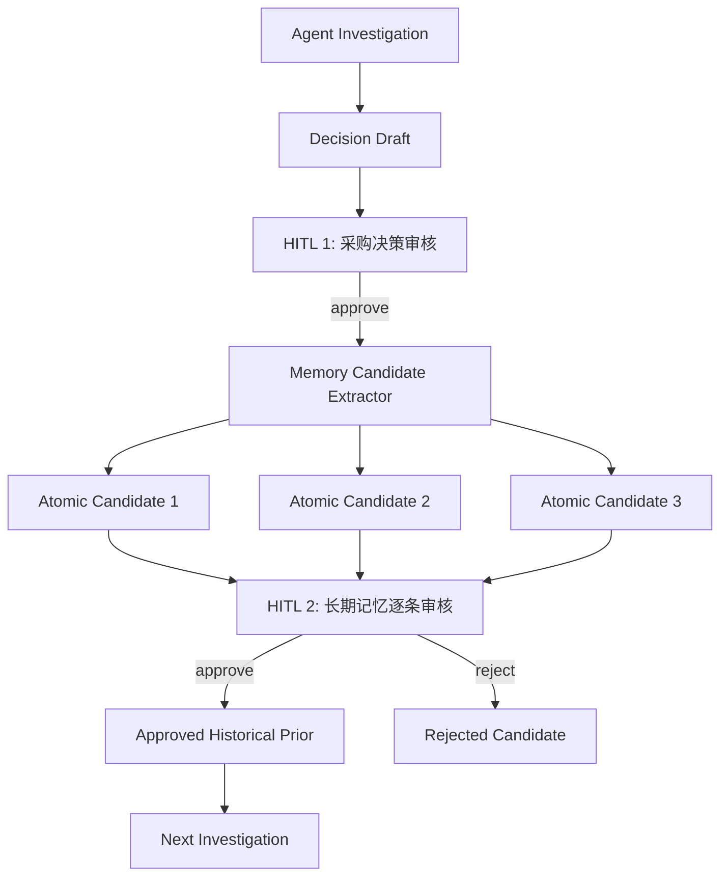

# 双层 HITL 与长期记忆边界

```mermaid
flowchart TD
  A[Agent Investigation] --> B[Decision Draft]
  B --> C[HITL 1: 采购决策审核]
  C -->|approve| D[Memory Candidate Extractor]
  D --> E1[Atomic Candidate 1]
  D --> E2[Atomic Candidate 2]
  D --> E3[Atomic Candidate 3]
  E1 --> F[HITL 2: 长期记忆逐条审核]
  E2 --> F
  E3 --> F
  F -->|approve| G[Approved Historical Prior]
  F -->|reject| H[Rejected Candidate]
  G --> I[Next Investigation]
```

`Historical Prior` 只能指导下一步核验，永远不等同于当前 Evidence，也不能单独形成 RiskEvent 或引用。
