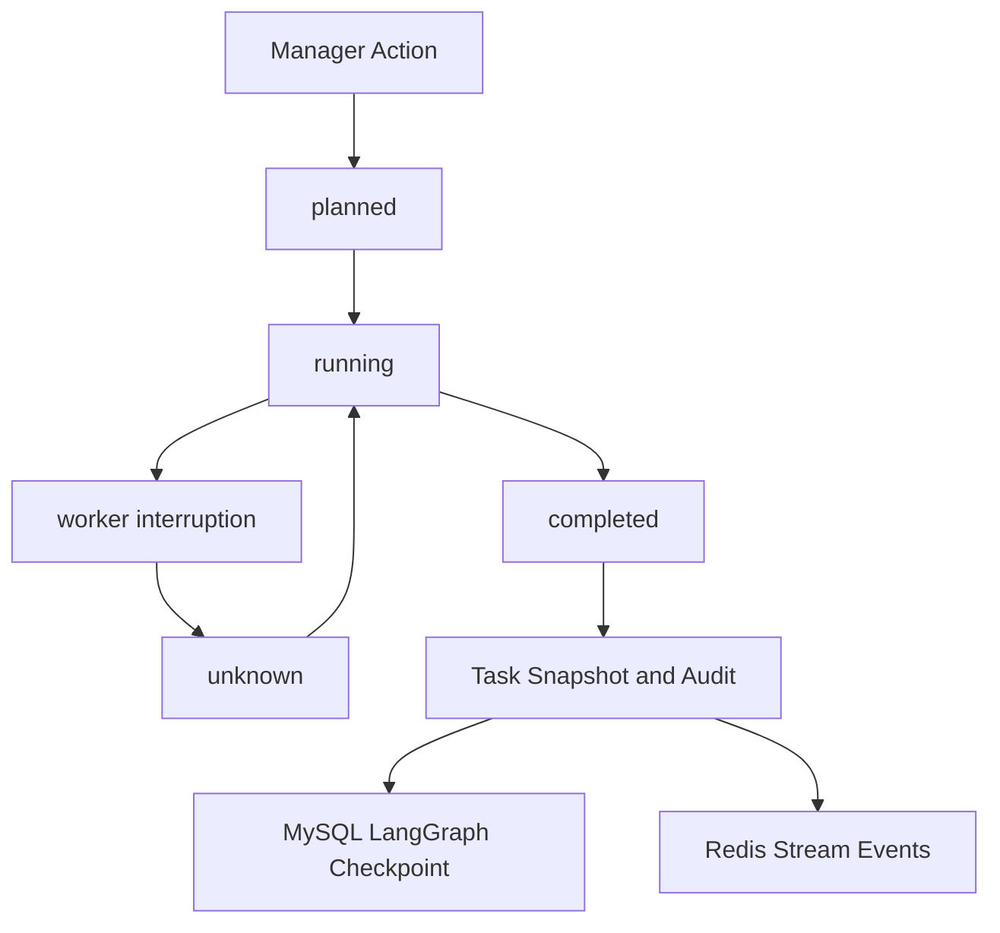

# Persistence and Recovery

```mermaid
flowchart TD
  A[Manager Action] --> B[planned]
  B --> C[running]
  C --> D[completed]
  C --> E[worker interruption]
  E --> F[unknown]
  F --> C
  D --> G[Task Snapshot and Audit]
  G --> H[MySQL LangGraph Checkpoint]
  G --> I[Redis Stream Events]
```

同一 `action_id` 在恢复时复用，TaskRepository 通过乐观锁保护业务投影，LangGraph native checkpoint 决定运行恢复点。
